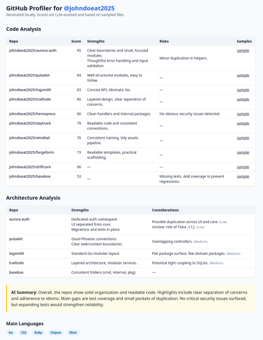

# GHP

A simple CLI tool for getting a quick overview of a developer's public GitHub repositories.

It uses an LLM (like GPT-4 or Gemini) to analyze a user's repos and generate a summary report. It's designed to give you a high-level starting point for a more in-depth, human-driven review.

You can see an example report [here](./out/profile-johndoeat2025.html).



## Setup

**1. Build the binary:**

```bash
make build
```

**2. Configure the app:**

Edit the `config/config.yml` file. You'll need to add a [GitHub Personal Access Token](https://github.com/settings/tokens) with `public_repo` scope to the `github_token` field.

**3. Set your LLM API Key:**

The tool needs an API key for your chosen LLM provider. Set it as an environment variable:

*   **For OpenAI:**
    ```bash
    export OPENAI_API_KEY="your_key_here"
    ```
*   **For Gemini:**
    ```bash
    export GEMINI_API_KEY="your_key_here"
    ```

## Usage

The easiest way to run it is with `make`:

```bash
# Run with OpenAI for the default user (set in the makefile)
make run-openai

# Run with Gemini for a different user
make run-gemini GHUSER=some_other_user
```

You can also run the compiled binary directly:

```bash
./bin/ghp --user some_user --provider openai
```

## Output

Reports are saved as HTML files in the `out/` directory.